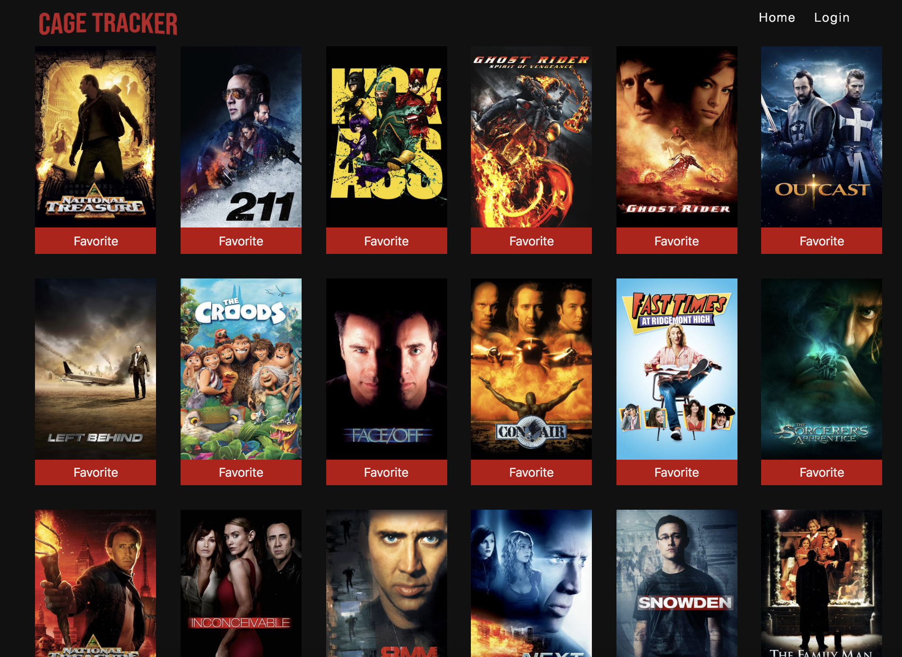
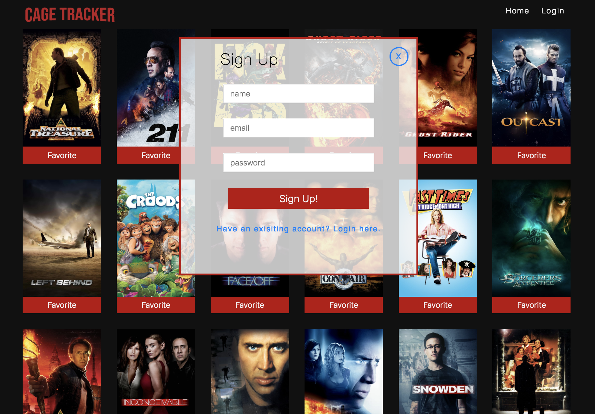
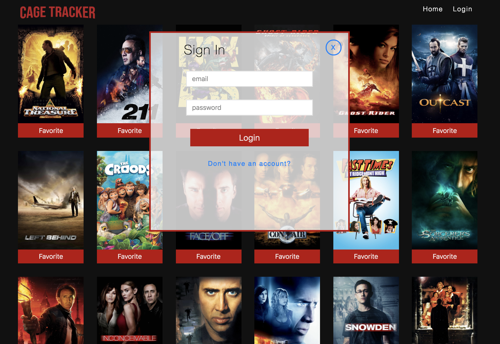
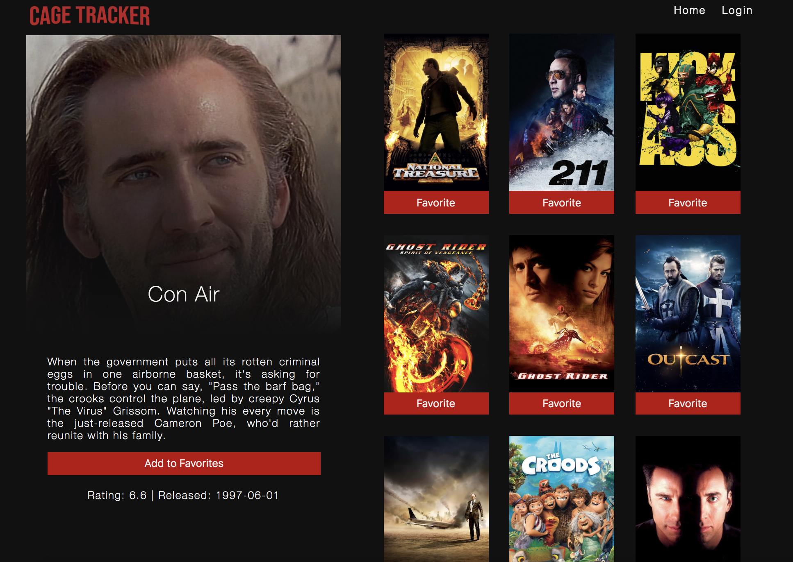
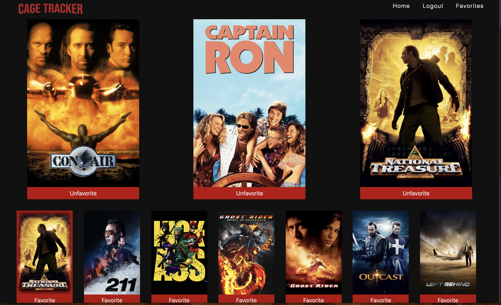

# Cage Tracker
## Overview

Ever have trouble picking your favorite Nicolas Cage Movie? Cage Tracker is a dynamic application that allows a user to see a list of the most popular Nicolas Cage movies and a summary of each movie, built with React, Router and Redux. The user can create an account and add movies to a favorites page, which the user can reference whenever they need to pick a movie to watch! A tribute to the greatest actor of all time.

Shoutout to Casey Poe!

Set Up Instructions 
```
npm install
npm start
```

## Collaborators
A Turing- Module 3 project with:
[Jeremiah Stanley](https://github.com/jeremiahjstanley), 
[Spenser Leighton](https://github.com/spenserleighton1)
[Tory Dannenberg](https://github.com/tdberg21),

## Screenshots
Home Page


Sign Up Page


Login Page


Movie Details


Favorites
